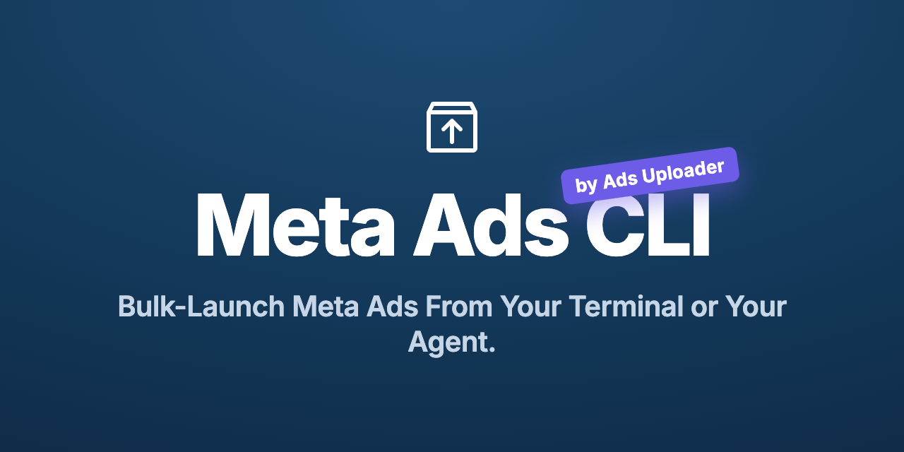

<p align="center">
  
</p>

<h1 align="center">Ads Uploader — Meta Ads CLI</h1>

<p align="center">The <strong>Meta Ads CLI</strong> by Ads Uploader helps you create and manage Meta (Facebook &amp; Instagram) ads from your terminal or an AI agent — same pipeline as the web app.</p>

<p align="center">
  <a href="https://www.npmjs.com/package/@adsuploader/cli"></a>
  <a href="https://adsuploader.com/meta-ads-cli"></a>
  
  <a href="https://github.com/adsuploader/meta-ads-cli/stargazers"></a>
</p>

---

Ads Uploader turns an existing ad into a reusable template and builds brand-new ads on top of it — new media, copy, CTA, and targeting — in bulk. The `ads` CLI drives that pipeline from your terminal or from an AI agent. Prefer a fully hosted, agent-native experience? See the [Meta Ads MCP server](https://github.com/adsuploader/meta-ads-mcp).

> **Safe by default.** `ads create:preview` resolves posts and checks Meta permissions without creating anything, and new ads are **paused** unless you say otherwise. Nothing spends until you unpause it in Meta.

## Why Ads Uploader

Founded on a decade of hands-on Meta advertising, Ads Uploader gives you the **deepest, most complete Meta (Facebook &amp; Instagram) ad-creation workflows available** — everything needed to actually ship campaigns end to end:

- **Template from any live ad** — copy a proven ad's exact settings, then rebuild on top with new media, copy, and targeting.
- **Real bulk** — many ads across campaigns and ad sets in a single command, with per-ad and per-ad-set text.
- **Partnership / branded content ads** — uploaded-media partnerships (Facebook + Instagram) and imported Instagram creator posts.
- **Duplicate preserving social proof** — clone by post so likes, comments, and shares carry into new campaigns.
- **Creative depth** — carousel, flexible, Multi-Media, Dynamic Optimization, creative enhancements, Advantage+ targeting.
- **Human-in-the-loop by design** — validate-only previews, paused-by-default creation, and saved builds you finish in the web app.

Built by a team that runs Meta ads at scale, and trusted by performance marketers and agencies managing serious Meta budgets.

## Install

```bash
npm install -g @adsuploader/cli
ads login
```

Requires Node.js 18 or later. `ads login` authenticates in your browser — no token copying.

## Quick start

```bash
ads accounts                     # list your ad accounts
ads account act_123456           # set the default account
ads upload hero.jpg https://cdn.example.com/video.mp4   # local files and public URLs
ads upload:drive "https://drive.google.com/drive/folders/..."   # a whole Drive folder
ads create:preview spec.json     # dry run — see exactly what would be created
ads create spec.json             # create the ads (paused by default)
```

A spec is a small JSON file describing what to build — the media, the copy, the CTA, targeting, and which existing ad to template from. See the [full spec reference](https://adsuploader.com/docs/ad-configuration/cli).

## Commands

| Command | What it does |
| --- | --- |
| `ads login` | Authenticate via browser |
| `ads accounts` · `ads account <id>` | List ad accounts · set the default |
| `ads campaigns` · `ads campaign <id>` · `ads adset <id>` · `ads ad <id>` | Browse campaigns, ad sets, ads, and creative |
| `ads pages` | List Facebook Pages (and connected Instagram accounts) |
| `ads targeting:search <query> --type zip` | Find Meta targeting keys |
| `ads upload <inputs…>` · `ads upload:drive <url>` · `ads uploads` | Upload media from files/URLs/Drive · list batches |
| `ads create spec.json` · `ads create:preview` · `ads create:interactive` | Create ads · dry-run · guided wizard |
| `ads duplicator:post-id [spec]` · `…:preview` | Duplicate ads by Page post ID (keeps social proof) |
| `ads presets` · `ads presets:save …` | Reusable API/text presets |
| `ads builds` · `ads builds:create` · `ads builds:update` · `ads builds:fork` · `ads builds:delete` | Saved builds you can review and launch in the web app |
| `ads jobs <id>` | Check a background job |

## Drive it from an AI agent

The package ships a `SKILL.md` describing every command and option for coding agents (Claude Code, Cursor, Codex). Point your agent at `node_modules/@adsuploader/cli/SKILL.md`, then ask in plain language:

- *"Using any ad from my Sales ad set as the template, launch these 100 creatives — and write a unique headline and primary text for each."*
- *"Duplicate the ad behind this Facebook post into my Retargeting ad set so the likes and comments carry over."*
- *"Assemble a build from these creatives and copy, then give me the link to review and launch it in the web app."*

## Partnership (branded content) ads

The CLI launches partnership ads two ways — your **own uploaded media** as a Facebook/Instagram partnership, or an **imported Instagram creator post** — by adding `profile.partnership` to a spec, with shared or per-ad/ad-set sponsors and a launch-wide header mode. `ads create:preview` reports each ad's effective sponsor and checks authorization before anything is created. Facebook post imports and Threads-on-imported-posts aren't supported. Full field reference: [`SKILL.md`](./SKILL.md) and the [docs](https://adsuploader.com/docs/ad-configuration/cli).

## Hand off to the web app

Instead of launching headlessly, assemble a **saved build** and finish it in the UI you know:

```bash
ads builds:create --account act_123 --name "Agent draft" --spec spec.json
# Open the printed web URL, review, and press Create Ads.
```

The build hydrates in the Ads Uploader web uploader — an open tab picks it up automatically — so you keep a human review-and-launch step. For agent-assisted launches, this is the recommended flow.

## Learn more

- **Full CLI reference:** [adsuploader.com/docs/ad-configuration/cli](https://adsuploader.com/docs/ad-configuration/cli)
- **Website:** [adsuploader.com/meta-ads-cli](https://adsuploader.com/meta-ads-cli) · **Docs:** [adsuploader.com/docs](https://adsuploader.com/docs)
- **Security:** [SECURITY.md](./SECURITY.md) · **Privacy:** [PRIVACY.md](./PRIVACY.md)

## Support

Questions or issues: **support@adsuploader.com**

## License

© Pingzu Digital LLC. All rights reserved. The hosted service and packages are proprietary; this repository contains connector documentation and configuration.
